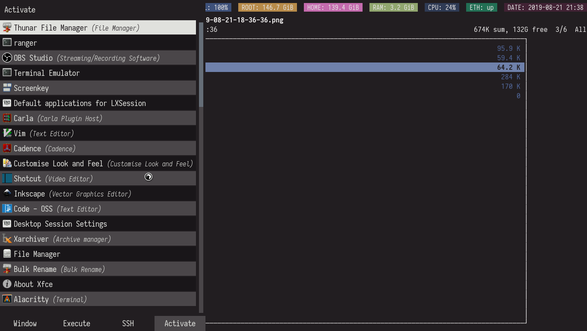

= dotfiles
:toc:

My dotfiles for my Linux-based system setup. 
The structure of this repo is designed to be managed with https://www.gnu.org/software/stow/[GNU Stow], a symlinks farm manager.

Don't blindly apply these dotfiles unless you know what you're doing. 
Review the code first, change the setting accordingly, and apply it.

== Screenshots
My setup was made by the FOSS gang. 

.i3 setup with multiple windows
image::docs/i3-multiple-windows.png[i3 setup with multiple windows]

.i3 setup with single window
image::docs/i3-single-window.png[i3 setup with single window]

.i3 setup with no window
image::docs/i3-no-window.png[i3 setup with no window]

.rofi setup

.vim and zathura (and LaTeX) setup
image::docs/vim-and-zathura.png[vim and zathura (and LaTeX) setup]

== Specifications
Here are the main specifications of my machine currently running this (as of 2019-08-09):

* **Operating system**: https://www.archlinux.org/[Arch Linux]
* **Display server**: X Window System using https://www.x.org/wiki/[Xorg]
* **Window manager**: https://i3wm.org/[i3] (specifically https://github.com/Airblader/i3[i3-gaps])
* **Terminal emulator**: https://github.com/jwilm/alacritty/[Alacritty]
* **Shell**: http://www.zsh.org/[Zsh]
* **Terminal emulator font**: https://github.com/be5invis/iosevka[Iosevka]

Terminal color scheme was generated with https://github.com/dylanaraps/pywal[pywal]. 
The picture is used to generate the color pallete is https://www.reddit.com/r/wallpapers/comments/cckpj0/i_made_this_simple_and_clean_drawing_over_the/[this one]. 
It's also the wallpaper used in the screenshots.

== Wallpapers
Here are the wallpapers' filename along with their sources:

* https://www.reddit.com/r/wallpapers/comments/cckpj0/i_made_this_simple_and_clean_drawing_over_the/[`nebula.jpg`]
* https://www.reddit.com/r/wallpapers/comments/co9t14/sand/[`sand.jpg`]

== Custom scripts
My own scripts is in link:.scripts/[`.scripts/`] and should be linked in `$HOME/.scripts`.
This is mostly used for using scripts from different configs such as from i3 and dunst.

== Configured programs
Here's a list of the programs with details on the config found in this repo. 
Each of the directory is designed to be used/managed with https://www.gnu.org/software/stow/[GNU Stow] at the indicated target path.

=== https://www.zsh.org/[Zsh]
A Unix shell and an alternative to the Bash.

* Config found at link:zsh/[`zsh/`] directory.
* The usual target path for a user is at `$HOME/`.
* Minimum version (from `zsh --version`):
** `zsh 5.7.1 (x86_64-pc-linux-gnu)`
* Take note that the configuration assumes that you install https://github.com/robbyrussell/oh-my-zsh/[Oh My Zsh!] after.

=== https://www.x.org/wiki/[Xorg]
A display server implementing X window system.

* Config found at link:xorg/[`xorg/`] directory.
* The usual target path for a user is at `$HOME/`.
* Minimum version (from `Xorg -version`):
** `X.Org X Server 1.20.5`
** `X Protocol Version 11, Revision 0`
* The configuration is found at `.Xresources` containing the colors (0 to 15, foreground, and the background).

=== https://github.com/yshui/compton[Compton]
A window compositor that adds off-screen buffers and additional effects and animations to the window. 
Can be used for adding style to your setup.

* Config found at link:compton/[`compton/`] directory.
* The usual target path for a user is at `$HOME/.config/compton`.
* Minimum version (from `compton --version`):
** `v7.2`
* The config is copied from `/etc/xorg/compton.conf` and edited a few parameters.

=== https://www.vim.org/[Vim]
A modal text editor.

* Config located at link:vim/[`vim/`] directory.
* The usual target path for a user is at `$HOME/`.
* Minimum version (from `vim --version`): 
** `8.1 (2018 May 18, compiled Jul 29 2019 20:38:53)`
* Uses https://github.com/junegunn/vim-plug[`vim-plug`] as the plugin manager.
* Contains my plugin list and editor configurations at `.vimrc`.
* There are also some https://github.com/sirver/UltiSnips[UltiSnips] snippets stored in `own-snippets` folder (since `snippets` is a reserved folder name). 
* One of the largest snippet file is the snippets for LaTeX files. 
It is based on https://github.com/gillescastel/latex-snippets/[_Gilles Castel_'s UltiSnips LaTeX snippets].

=== https://ranger.github.io/[Ranger]
A Vim-based file browser. 
https://github.com/ranger/ranger/wiki[Here's their config documentation for it.]

* Config located at link:ranger/[`ranger/`] directory.
* The usual target path for a user is at `$HOME/.config/ranger/`.
* Minimum version (from `ranger --version`):
** `ranger version: ranger 1.9.2`
** `Python version: 3.7.4 (default, Jul 16 2019, 07:12:58) [GCC 9.1.0]`
* All of the config files are basically default config files except with a few changes.
* Contains keybinding in `rc.conf`. Additional keybindings include the `O` keybinding and their variants for opening my go-to programs such as https://code.visualstudio.com/[Visual Studio Code].
* `rifle.conf` contains configuration for opening a list of programs. 

=== https://github.com/jwilm/alacritty/[Alacritty]
Similar to https://sw.kovidgoyal.net/kitty[Kitty] , it's a GPU-based terminal emulator. 
It's documentation for the configuration can be viewed at the config file itself being filled with comments.

* Config located at link:alacritty/[`alacritty/`] directory.
* The usual target path for a user is at `$HOME/.config/alacritty/`.
* Minimum version (from `alacritty --version`):
** `alacritty 0.3.3`
* Contains a single `alacritty.yaml` as the config file. Not much has changed except for the color scheme and the font being used.

=== https://github.com/Airblader/i3[i3-gaps] 
A fork of i3 window manager. 
https://i3wm.org/docs[Here's the documentation page of the program.]

* If it's any of importance, the configuration is prone to be moved for the https://github.com/i3/i3/[original version of i3] since https://github.com/i3/i3/issues/3724[there's consideration for merging of gaps into i3].
* The usual target path for a user is at `$HOME/.config/i3/`.
* Config located at link:i3/[`i3/`] directory.
* Minimum version (from `i3 --version`):
** `i3 version 4.17 (04.08.2019) © 2009 Michael Stapelberg and contributors`
* Uses https://github.com/davatorium/rofi[`rofi`] as the application launcher and serves as a replacement for https://tools.suckless.org/dmenu/[`dmenu`].
* The containing config (`config`) is simply the default config with my personal config added into it. 
Not much to say here except I use `i3bar` (the default bar) and https://github.com/i3/i3status[`i3status`] (the default status bar config) to fill in.
* The config for `i3status` is located in a different directory at link:i3status[`i3status/`] containing a single `config` file (for now).
* Also, it uses scripts from the link:.scripts/[`.scripts/`] directory so be sure to put those in the appropriate location as well.

=== https://github.com/davatorium/rofi[Rofi]
The application switcher and launcher. 
Also serves as a replacement for https://tools.suckless.org/dmenu/[dmenu].

* Config located at link:rofi/[`rofi/`].
* The usual target path for a user is at `$HOME/.config/rofi/`.
* Minimum version (from `rofi -version`):
** `Version: 1.5.4`
* Main config is `config.rasi`.
* My i3 setup uses Rofi with my custom theme (`fds-sidebar`) with `$mod+D` (see image above). Every variation of my sidebar theme should import the common file (`fds-sidebar-common.rasi`) and only declare the colors. 
See `fds-sidebar-dark.rasi` for an example. 

=== https://www.gtk.org/[GTK]
A library for creating programs with graphical user interface (GUI).

There are often two versions when configuring GTK: version 2 and 3.

* Version depends on the program itself since it is usually statically linked within the GUI program.
* GTK3 config located at link:gtk3/[`gtk3/`].
* The usual target path of GTK3 for a user is at `$HOME/.config/gtk-3.0/`.
* Simply contains a `settings.ini` file that contains common configuration that'll be applied for most GTK3 apps (Thunar, Inkscape, etc.).
* GTK2 config located at link:gtk2/[`gkt2/`].
* The usual target path of GTK2 for a user is at `$HOME/` because of the `.gtkrc-2.0` file needs to at `$HOME/`.
* GTK color and icon theme is https://github.com/NicoHood/arc-theme[Arc theme] 
and uses the light dark variation (`arc-darker`).

=== https://dunst-project.org/[Dunst]
It's a notification daemon used to display notifications sent by notifiers (programs that send messages/notifications).

* Config location is at link:dunst/[`dunst/`].
* The usual target path for a user is at `$HOME/.config/dunst/`.
* Minimum version (from `dunst --version`):
** `Dunst - A customizable and lightweight notification-daemon 1.4.1 (2019-07-03)`
* Simply contains a `dunstrc` configuring appearance of the notifications.

=== https://www.archlinux.org/pacman/[pacman]
The default package manager for Arch Linux.

* Config location is at link:pacman/[`pacman/`]
* The usual target path is at `/etc/pacman.d`.
* Minimum version (from `pacman --version`):
** `Pacman v5.1.3 - libalpm v11.0.3`
* Contains the configuration file, a `mirrorlist` file, and some https://www.archlinux.org/mirrorlist/?ip_version=6[pacman hooks].
* For the mirrorlist, change it accordingly or https://www.archlinux.org/mirrorlist/?ip_version=6[generate another one].

== Additional programs used
As much as possible, I use free and open source software for all of my needs. 

=== System administration
TIP: I recommend to start at this list especially if you're starting with a bare minimum of a Linux installation.

* https://hisham.hm/htop/[htop] - A process viewer and manager.
* https://github.com/lxde/lxsession[lxsession] - A session manager and an authentication agent for Polkit; very useful if you're usually using with a user-level account.
* https://www.freedesktop.org/wiki/Software/polkit/[Polkit] - A program for bridging unprivileged processes to privileged access.
* https://wiki.archlinux.org/index.php/Systemd-boot[systemd-boot] - The UEFI boot manager.
* https://www.freedesktop.org/wiki/Software/udisks/[udisks] - A manager for mounting filesystems.
* https://github.com/coldfix/udiskie[udiskie] - An automounter for removable media.

=== General purpose programs
* https://audacious-media-player.org/[Audacious] - An audio player with various listening options.
* https://feh.finalrewind.org/[feh] - A minimal image viewer.
* https://www.mozilla.org/en-US/firefox/new/[Firefox] - One of the major web browser second to Chrome.
* https://github.com/naelstrof/maim[maim] - A simple screenshot utility.
* https://obsproject.com/[OBS Studio] - A facility for streaming and recording videos.
* https://www.shotcut.org/[Shotcut] - A video editor built with the https://www.mltframework.org/[MLT Framework].
* https://docs.xfce.org/xfce/thunar/start[Thunar] - A file manager. A part of the Xfce desktop environment.
* https://www.thunderbird.net/[Thunderbird] - A email client.
* https://www.videolan.org/vlc/[VLC Media Player] - A multimedia player.
* https://weechat.org/[Weechat] - An IRC client on the command line.

=== Device drivers and servers
* https://wiki.archlinux.org/index.php/Advanced_Linux_Sound_Architecture[ALSA] - A Linux 
sound driver.
* https://ffmpeg.org/[ffmpeg] - A multimedia codec including for MP4, FLV, and more. Also can be used as a recorder.
* https://wiki.archlinux.org/index.php/NetworkManager[GNOME NetworkManager]
* https://www.nvidia.com/Download/index.aspx?lang=en-us[NVIDIA Driver] - Since 
I have an NVIDIA-based GPU (NVIDIA GeForce GT 630), I have to use that. I also have to 
use the https://www.archlinux.org/packages/extra/x86_64/nvidia-390xx/[legacy version].

=== Music production
* https://kx.studio/Applications:Cadence[Cadence] - A set of audio tools. Part of the KX Studio project.
* https://kx.studio/Applications:Carla[Carla] - An audio plug-in host supporting various audio 
plug-in formats such as VST2/3, SF2, and SFZ. Part of the KX Studio project.
* https://lmms.io/[LMMS] - A digital audio workstation for beat production.
* https://musescore.org/[Musescore] - A music composition and notation software.

=== Design
* https://blender.org/[Blender] - A top-notch 3D modelling program.
* https://www.freecadweb.org/[FreeCAD] - A general purpose 3D computer-aided design program.
* https://inkscape.org/[Inkscape] - A vector illustration/editing program. Alternative to Adobe Illustrator.
* https://krita.org/en/[Krita] - A painting/illustration program. 

=== Fonts
* https://github.com/belluzj/fantasque-sans[Fantasque Sans Mono]
* https://github.com/tonsky/FiraCode[Fira Code] - A programmer-oriented font that supports ligatures.
* https://github.com/be5invis/iosevka[Iosevka]
* https://github.com/googlefonts/noto-fonts[Noto Fonts]

=== Documents
* https://asciidoctor.org/[Asciidoctor] - A text formatting language suitable for creating books, documentations, and writings. Highlights a heavier feature set compared to Markdown.
* https://www.libreoffice.org/[LibreOffice] - An office productivity suite and serves as a free alternative to Microsoft Office suite.
* https://www.tug.org/texlive/[TeX Live] - A cross-platform LaTeX distribution for compiling LaTeX files. 
* http://luatex.org/[LuaTeX] - The TeX engine I primarily use for my LaTeX documents. 

=== Mathematical tools
* https://www.anaconda.com/[Anaconda] - A mathematical environment distribution.
* https://www.gnu.org/software/octave/[Octave] - A mathematical computational environment similar to Matlab.

=== Software development
* https://cmake.org/[CMake] - A cross-platform build system that takes care of build configurations.
* https://gcc.gnu.org/[GCC] - A set of compilers from GNU. I mainly use it for developing and compiling C and C++ languages.
* https://git-scm.com/[Git] - My one and only version control system.
* https://godotengine.org/[Godot Engine] - A game engine with its own interface.
* https://www.gnu.org/software/make/[Make] - A build automation system.
* https://code.visualstudio.com/[Visual Studio Code] - A text editor that comes with lightweight IDE features.
* The programming language runtime for https://www.python.org/[Python], 
https://www.ruby-lang.org/en/[Ruby], https://www.java.com/[Java], 
https://www.rust-lang.org/[Rust], and https://golang.org/[Go].

=== Browser extensions 
* https://bitwarden.com/[Bitwarden] 
* Internet Archive Web Extension (https://chrome.google.com/webstore/detail/wayback-machine/fpnmgdkabkmnadcjpehmlllkndpkmiak[Chrome] and https://addons.mozilla.org/en-US/firefox/addon/wayback-machine_new/[Firefox] version)
* https://github.com/gorhill/uBlock[uBlock Origin]
* https://github.com/brunolemos/simplified-twitter[Simplified Twitter]
