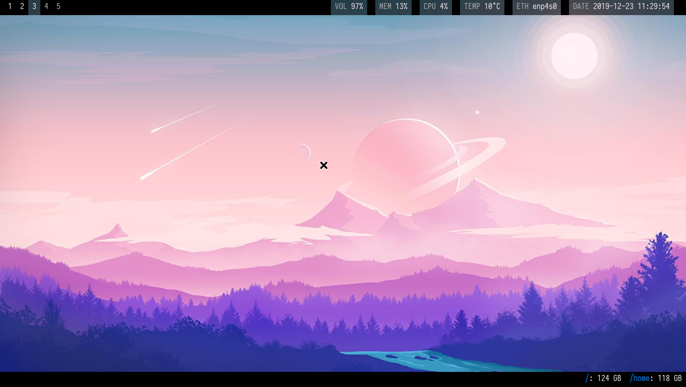
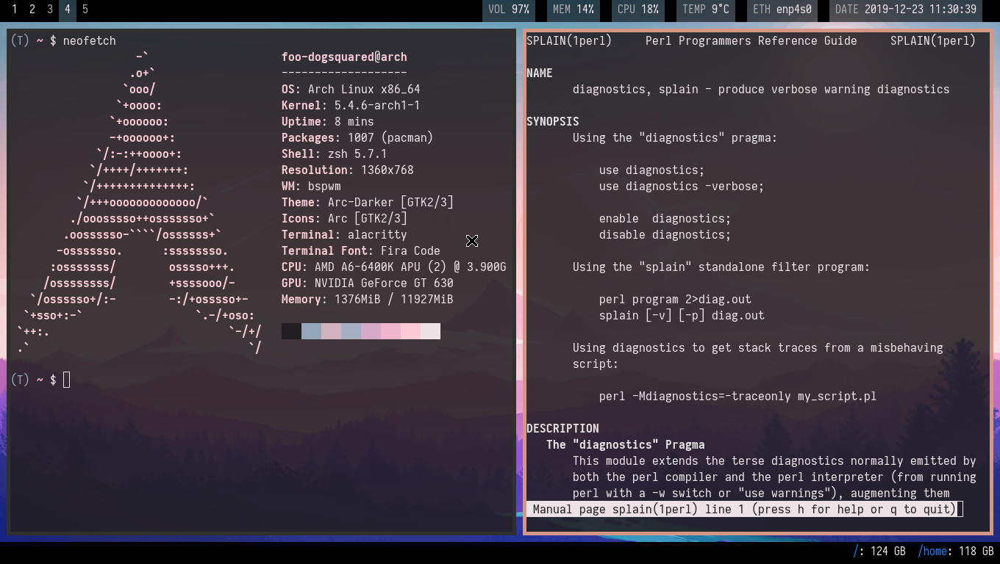
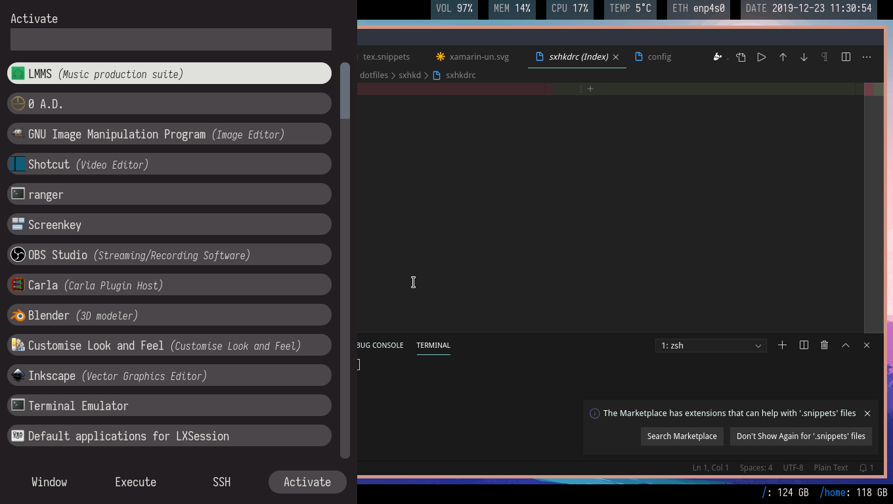
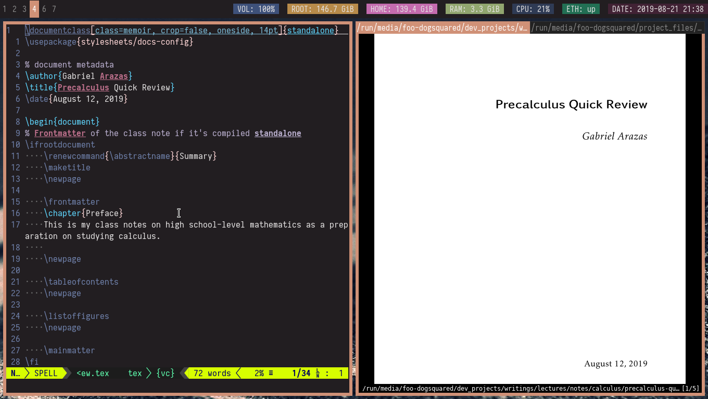
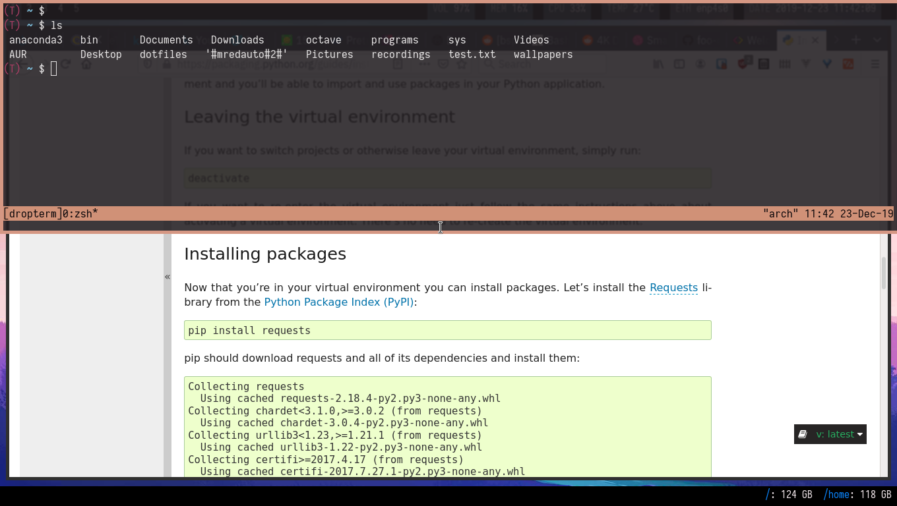

= dotfiles
:toc:

My dotfiles for my Linux-based system setup. 
The structure of this repo is designed to be managed with https://www.gnu.org/software/stow/[GNU Stow], a symlinks farm manager. 

I don't know what I'm doing most of the time in creating this setup so if you're brave (or suicidal) enough to take a look at my stuff (that may or may not be an escaped entry from the SCP Foundation), go ahead. 

CAUTION: Don't blindly apply these dotfiles unless you know what you're doing. 
Review the code first, change the setting accordingly, and apply it. 

== Inspirations

* https://github.com/addy-dclxvi/almighty-dotfiles/ 
* https://github.com/LukeSmithxyz/voidrice 
* https://www.reddit.com/r/unixporn/ (pretty much the little details) 
* Specifically for https://www.reddit.com/r/unixporn/comments/8ezsq7/bspwm_terminal_tabs_in_polybar_dark_and_dull_exam/[the tabbed terminals idea] and the https://github.com/Nikzt/dotfiles[linked dotfiles repo]) (not yet implemented, still cleaning up my stuff) 
* https://www.reddit.com/r/unixporn/comments/edmb8b/awesome_gnawesome/[Just] https://github.com/ilovecookieee/Glorious-Dotfiles[saving] https://github.com/PapyElGringo/material-awesome[these] for an **awesome** future, hehehe. 

== Screenshots

My setup was made by the FOSS gang. 

.bspwm setup with no windows

.bspwm with the terminals

.rofi and VS Code setup

.vim and zathura (and LaTeX) setup

.A dropdown terminal (because why not)

== Specifications

Here are the main specifications of my machine currently running this (as of 2019-08-09):

* **Operating system**: https://www.archlinux.org/[Arch Linux]
* **Display server**: X Window System using https://www.x.org/wiki/[Xorg]
* **Window manager**: https://github.com/baskerville/bspwm[bspwm]
* **Terminal emulator**: https://github.com/jwilm/alacritty/[Alacritty]
* **Shell**: http://www.zsh.org/[Zsh]
* **Terminal emulator font**: https://github.com/be5invis/iosevka[Iosevka]
* **GTK theme**: https://github.com/horst3180/Arc-theme[Arc theme] (Arc Darker variant)

== Wallpapers

Here's a list of the wallpapers I've used throughout my ricing journey. 
I've also tried to get the creators to show appreciation for their work. 

* https://www.deviantart.com/rmradev/art/Alien-Moon-743912901[`alien-moon.jpg`] 
** Creator: https://www.deviantart.com/rmradev[rmRadev]

* https://dribbble.com/shots/3713646-Small-Memory[`forest-bright.jpg`]
** Creator: https://dribbble.com/MikaelGustafsson[Mikael Gustafsson] 

* https://dropr.com/mbdsgns/254740/hotline_miami_iv/+?p=1388845[`hotline-miami-alt-cover.png`] 
** Creator: https://dropr.com/mbdsgns[Mbdsgns]

* https://www.artstation.com/artwork/wn8ng[`long-walk-home.jpg`]
** Creator: https://www.artstation.com/beaulamb[Beau Lamb]

* https://www.reddit.com/r/wallpapers/comments/cckpj0/i_made_this_simple_and_clean_drawing_over_the/[`nebula.jpg`]
** Creator: https://www.reddit.com/user/datGryphon/[datGryphon]

* https://www.artstation.com/artwork/XOQdR[`the-core.jpg`]
** Creator: https://www.artstation.com/beaulamb[Beau Lamb]

* https://www.reddit.com/r/wallpapers/comments/ebvk0q/rocket_launch_1920x1080/[`rocket-launch.jpg`]

* https://www.reddit.com/r/wallpapers/comments/co9t14/sand/[`sand.jpg`]

== Tour of my setup 

There are a few things to know on this setup. 

* `packages.txt` is mainly for archiving my native package list from the official Arch Linux repos installed in my current Arch Linux setup. 
* `aur-packages.txt` contains the installed packages from AUR along with their versions. 
* `locations.json` is a data file that contains all of the packages listed in <<Configured programs>> along with their target path. 
* `manager.py` is a little manager tailored for this setup. 
* A makefile (named `makefile`) which makes use of GNU Make. 

`packages.txt` and `aur-packages.txt` are simply a list of installed packages from the official Arch repo and AUR respectively. 
 They are going to be committed at the start of every month (if it works that is). 

`manager.py` is a tiny https://www.gnu.org/software/stow/[GNU Stow]-inspired manager created for this setup. 
(Nonetheless, I tried to make it generic for other cases.) 
It takes a directory with a file named `locations.json` containing the packages with their target path. 
We can then execute commands with all of the packages and its target path. 
footnote:[Obviously, you need Python installed for this.
For future references, the version by the time first writing the script is at v3.8.1.] 

[source, shell]
----
# Take the setup as the filesystem structure. 
# See the JSON file (locations.json) to see what packages to be installed and where to install them. 

# Running the program without any arguments for a test run. 
# There should be a bunch of `echo` commands being ran for all of the listed packages. 
./manager.py

# Create the directories of the target path and install them with GNU Stow. 
# Bada-bing, bada-boom, you have installed your setup or something. 
./manager.py --commands "mkdir -p {location}" "stow --restow {package} --target {location}"
----

Just execute the script with the `--help` flag for more information. ;p 

Next, more custom scripts. 
They're located in link:bin/[`bin/`] and ideally should be linked in `$PATH`. 
Currently, I have them linked in `$HOME/bin`. 

The scripts are mostly used with hotkey bindings (e.g., `sxhkd`). 
Nonetheless, they could be executed in the shell (provided they are linked in `$PATH`). 

Here's a list of the top most useful scripts:

* link:./bin/screenshot[Screenshot capture]. 
Includes the option of delaying and region selection mode. 

* link:./bin/ocr[An image-to-text script using OCR]. 
The content are then copied into the clipboard. 
Built on top of the screenshot script. 
Useful for capturing links in images or videos. 

* link:./bin/record[Screen recording] using https://ffmpeg.org/[FFmpeg]. 
An option of excluding and/or following the mouse cursor is included. 

* link:./bin/prompt[Quick command prompts]. 
The script is based from https://github.com/LukeSmithxyz/voidrice/blob/master/.local/bin/prompt[Luke Smith's prompt script]. 

* link:./bin/toggle-bin[Switching on/off programs]. 
Useful for situations where only one instance of the program is running. 

Aside from the scripts, there are also some details and files that are not committed to this setup for privacy and security reasons. 
A few examples of which is my cron setups where it is tasked with updating and committing the package lists to the Git repo, updating the packages, cleaning the cache, and so much more. 

== Configured programs

Here's a list of the programs with details on the config found in this repo. 
Each of the listed directory is designed to be used/managed with https://www.gnu.org/software/stow/[GNU Stow] at the indicated target path.

=== https://github.com/baskerville/bspwm[bspwm]

A minimalist window manager. 
Only provides a window manager and nothing else. 

* Config located at link:bspwm/[`bspwm/`] directory. 
* The usual target path for a user is at `$HOME/.config/bspwm/`. 
* Minimum version (from `bspwm --version`):
** `0.9.7-10-g2ffd9c1`
* Simply contains `bspwmrc` which is an executable setting up bspwm-related settings and and starting up some applications. 
* This allows for a modular setup. 
For using keybindings, it uses `sxhkd` (Simple X Hotkey Daemon). 
For something similar to i3-bar, https://github.com/polybar/polybar[polybar] serves as the replacement. 

=== https://github.com/baskerville/sxhkd[sxhkd]

Stands for "Simple X Hotkey Daemon". 
It is a hotkey daemon detecting certain X events primarily from the keyboard and mouse. 

It is also very useful since it enables modular setup. 
Can be used independent of the desktop environment (DE) or the window manager (WM). 

* Config located at link:sxhkd/[`sxhkd/`] folder.
* The usual target path is at `$HOME/.config/sxhkd`. 
* Minimum version (from `sxhkd --version`):
** `0.6.0-3-g7124055`
* Contains a config file (`sxhkdrc`) for the keybindings. 
There are some keybindings specifically used for `bspwm`. 

=== https://github.com/polybar/polybar[polybar]

A tool for creating status bars. 

This is the replacement bar from my previous i3-based setup. 

* Config located at link:polybar[`polybar/`]. 
* The usual target path for a user is at `$HOME/.config/polybar`. 
* Minimum version (from `polybar --version`): 
** `polybar 3.4.1`
** `Features: +alsa +curl +i3 +mpd +network(libnl) +pulseaudio +xkeyboard`
* There is only the standalone config (might decide to make it modular) and the launch script which is copied from the https://wiki.archlinux.org/index.php/Polybar[related Arch Wiki entry]. 

For documentation, check out the https://wiki.archlinux.org/index.php/Polybar[already linked Arch Wiki entry] and the https://github.com/polybar/polybar/wiki[official documentation from GitHub]. 

=== https://github.com/davatorium/rofi[Rofi]

The application switcher and launcher. 
Also serves as a replacement for https://tools.suckless.org/dmenu/[dmenu].

* Config located at link:rofi/[`rofi/`].
* The usual target path for a user is at `$HOME/.config/rofi/`.
* Minimum version (from `rofi -version`):
** `Version: 1.5.4`
* Main config is `config.rasi`.
* Contains the config and my custom Rofi themes. 

To see the documentation, check out the manual entry for `rofi`. 
For creating or editing Rofi themes, read the manual entry of `rofi-theme`. 
Also, view the related https://wiki.archlinux.org/index.php/Rofi[Arch Wiki entry]. 

=== https://www.zsh.org/[Zsh]

A Unix shell and an alternative to the Bash.

* Config found at link:zsh/[`zsh/`] directory.
* The usual target path for a user is at `$HOME/`.
* Minimum version (from `zsh --version`):
** `zsh 5.7.1 (x86_64-pc-linux-gnu)`
* Contains `.zprofile` and `.zshrc`. 
The primary file to look for is the `.profile` to set environment variables independent of the shell setups. 
* Previously relied on https://github.com/robbyrussell/oh-my-zsh/[oh-my-zsh]. 
Eventually, the config became independent and can work without it. 

For the documentation, check out the manual entry for `zsh` to gain an overview of the shell. 
The main manual explains some things such as the startup/shutdown files and compatibility with other shells. 
It also lays out the sections of the manual which you can check it out. 

Since the manual has been split into multiple sections, it can be daunting to navigate. 
The most referred sections by far are `zshmisc` where it gives details on the miscellanea of zsh such as the prompt and special variables you might want to know. 
The other section is `zshbuiltins` where it explains built-in commands of zsh. 

=== https://www.x.org/wiki/[Xorg]

A display server implementing X window system.

* Config found at link:xorg/[`xorg/`] directory.
* The usual target path for a user is at `$HOME/`.
* Minimum version (from `Xorg -version`):
** `X.Org X Server 1.20.5`
** `X Protocol Version 11, Revision 0`
* The configuration is found at `.Xresources` containing the colors (0 to 15, foreground, and the background). 

=== https://github.com/yshui/picom[picom]

A window compositor forked from https://github.com/chjj/compton[compton] that adds off-screen buffers and additional effects and animations to the window. 
Can be used for adding style to your setup. 

This is formerly the Compton configuration. 

* Config found at link:picom/[`picom/`] directory.
* The usual target path for a user is at `$HOME/.config/picom`.
* Minimum version (from `picom --version`):
** `v7.2`
* The config is copied from `/etc/xorg/picom.conf` and edited a few parameters. 

For documentation, check out the manual entry (i.e., `man picom`) and the https://wiki.archlinux.org/index.php/Picom[related Arch Wiki entry]. 
The default configuration (located at `/etc/xdg/picom.conf` assuming at Arch Linux) can be helpful as well as it is filled with comments. 

=== https://neovim.io/[Neovim]

A modern version of https://www.vim.org/[Vim], a modal text editor. 
footnote:[Migrated after I've seen https://lukesmith.xyz/[Luke-senpai] used it in his recent videos. 
Seriously though, I find nvim to be way better for configuration.]

* Config located at link:nvim/[`nvim/`] directory.
* The usual target path for a user is at `$HOME/.config/nvim`.
* Minimum version (from `nvim --version`): 
** `NVIM v0.4.3` 
* Uses https://github.com/junegunn/vim-plug[`vim-plug`] as the plugin manager.
* Contains my plugin list and editor configurations in `init.vim`.
* There are also some https://github.com/sirver/UltiSnips[UltiSnips] snippets stored in `own-snippets` folder (since `snippets` is a reserved folder name). 
* One of the largest snippet file is the snippets for LaTeX files. 
It is based on https://github.com/gillescastel/latex-snippets/[_Gilles Castel_'s UltiSnips LaTeX snippets].

=== https://ranger.github.io/[Ranger]

A Vim-based file browser. 
https://github.com/ranger/ranger/wiki[Here's their config documentation for it.]

* Config located at link:ranger/[`ranger/`] directory.
* The usual target path for a user is at `$HOME/.config/ranger/`.
* Minimum version (from `ranger --version`):
** `ranger version: ranger 1.9.2`
** `Python version: 3.7.4 (default, Jul 16 2019, 07:12:58) [GCC 9.1.0]`
* All of the config files are basically default config files except with a few changes.
* Contains keybinding in `rc.conf`. Additional keybindings include the `O` keybinding and their variants for opening my go-to programs such as https://code.visualstudio.com/[Visual Studio Code].
* `rifle.conf` contains configuration for opening a list of programs. 

=== https://github.com/jwilm/alacritty/[Alacritty]

Similar to https://sw.kovidgoyal.net/kitty[Kitty] , it's a GPU-based terminal emulator. 
It's documentation for the configuration can be viewed at the config file itself being filled with comments.

* Config located at link:alacritty/[`alacritty/`] directory.
* The usual target path for a user is at `$HOME/.config/alacritty/`.
* Minimum version (from `alacritty --version`):
** `alacritty 0.3.3`
* Contains a single `alacritty.yaml` as the config file. Not much has changed except for the color scheme and the font being used.

=== https://dunst-project.org/[Dunst]

It's a notification daemon used to display notifications sent by notifiers (programs that send messages/notifications).

* Config location is at link:dunst/[`dunst/`].
* The usual target path for a user is at `$HOME/.config/dunst/`.
* Minimum version (from `dunst --version`):
** `Dunst - A customizable and lightweight notification-daemon 1.4.1 (2019-07-03)`
* Simply contains a `dunstrc` configuring appearance of the notifications. 

Look out for the related manual entry (i.e., `man dunst`) and the https://wiki.archlinux.org/index.php/Dunst[Arch Wiki entry]. 

=== https://www.archlinux.org/pacman/[pacman]

The default package manager for Arch Linux.

* Config location is at link:pacman/[`pacman/`]
* The usual target path is at `/etc/pacman.d`.
* Minimum version (from `pacman --version`):
** `Pacman v5.1.3 - libalpm v11.0.3`
* Contains the configuration file, a `mirrorlist` file, and some https://www.archlinux.org/mirrorlist/?ip_version=6[pacman hooks].
* For the mirrorlist, change it accordingly or https://www.archlinux.org/mirrorlist/?ip_version=6[generate another one]. 
It is also monthly updated from a cron job. 
* The dotfiles repo also contains two package lists (i.e., `packages.txt` and `aur-packages.txt`) in the root of the project folder. 
* The setup also uses `yay` as the AUR helper tool. 

=== https://github.com/dylanaraps/pywal[Pywal] 

Pywal is a tool for generating color schemes from an image. 
It is mainly used to produce templates for different applications (e.g., Vim, Visual Studio, the tty). 

* The config directory is at `wal`. 
* The usual target path would be on `~/.local/share/wal`. 
The target path is more lenient since it only contains data files. 
You have more choices here. 
* Minimum version (from `wal -v`):
** `wal 3.3.0` 
* The folder only contains the best of the themes in JSON files. 
All of the data files are named after the filenames of the wallpapers. 
A few of them are listed in the <<Wallpapers>> section for the sources. 
The JSON files does need a little bit of tweaking especially with the `wallpaper` key. 
You could apply them with `wal --theme /path/to/file`. 
* To easily create some more themes into JSON, I've created a small script named `create-wal-theme` located in my custom scripts location. 

== Additional programs used

As much as possible, I use free and open source software for all of my needs. 

=== System administration

TIP: I recommend to start at this list especially if you're starting with a bare minimum of a Linux installation.

* https://hisham.hm/htop/[htop] - A process viewer and manager.
* https://github.com/lxde/lxsession[lxsession] - A session manager and an authentication agent for Polkit; very useful if you're usually using with a user-level account.
* https://www.freedesktop.org/wiki/Software/polkit/[Polkit] - A program for bridging unprivileged processes to privileged access.
* https://wiki.archlinux.org/index.php/Systemd-boot[systemd-boot] - The UEFI boot manager.
* https://www.freedesktop.org/wiki/Software/udisks/[udisks] - A manager for mounting filesystems.
* https://github.com/coldfix/udiskie[udiskie] - An automounter for removable media.

=== Desktop user experience 

* https://github.com/tmux/tmux/[tmux] - A terminal multiplexer useful for managing multiple sessions. 
* https://github.com/noctuid/tdrop[tdrop] - A modular dropdown creator. 
* https://github.com/reorr/mantablockscreen[mantablockscreen] - A lock screen. 
* https://github.com/dylanaraps/pywal[pywal] - An automation tool for generating color schemes from images and applying them to your programs. 
* https://github.com/dylanaraps/neofetch/[neofetch] - A program for getting information for your hardware and software setup. 

=== General purpose programs

* https://feh.finalrewind.org/[feh] - A minimal image viewer.
* https://www.mozilla.org/en-US/firefox/new/[Firefox] - One of the major web browser second to Chrome.
* https://github.com/naelstrof/maim[maim] - A simple screenshot utility.
* https://docs.xfce.org/xfce/thunar/start[Thunar] - A file manager. A part of the Xfce desktop environment.
* https://www.thunderbird.net/[Thunderbird] - A email client.
* https://weechat.org/[Weechat] - An IRC client on the command line.

=== Device drivers and servers

* https://wiki.archlinux.org/index.php/Advanced_Linux_Sound_Architecture[ALSA] - A Linux sound driver. 
* https://wiki.archlinux.org/index.php/NetworkManager[GNOME NetworkManager]
* https://www.nvidia.com/Download/index.aspx?lang=en-us[NVIDIA Driver] - Since I have an NVIDIA-based GPU (NVIDIA GeForce GT 630), I have to use that. 
I also have to use the https://www.archlinux.org/packages/extra/x86_64/nvidia-390xx/[legacy version].

=== Multimedia-related tools 

* https://audacious-media-player.org/[Audacious] - An audio player with various listening options.
* https://ffmpeg.org/[ffmpeg] - A multimedia codec including for MP4, FLV, and more. 
Also can be used as a recorder. 
* https://www.imagemagick.org/[ImageMagick] - A software suite for graphics. 
* https://obsproject.com/[OBS Studio] - A facility for streaming and recording videos. 
* https://www.shotcut.org/[Shotcut] - A video editor built with the https://www.mltframework.org/[MLT Framework]. 
* https://www.videolan.org/vlc/[VLC Media Player] - A multimedia player. 

=== Music production

* https://kx.studio/Applications:Cadence[Cadence] - A set of audio tools. Part of the KX Studio project. 
* https://kx.studio/Applications:Carla[Carla] - An audio plug-in host supporting various audio plug-in formats such as VST2/3, SF2, and SFZ. 
Part of the KX Studio project. 
* https://lmms.io/[LMMS] - A digital audio workstation for beat production. 
* https://musescore.org/[Musescore] - A music composition and notation software. 
* https://supercollider.github.io/[SuperCollider] - A platform for audio synthesis and algorithmic composition. 

=== Design

* https://blender.org/[Blender] - A top-notch 3D modelling program.
* https://www.freecadweb.org/[FreeCAD] - A general purpose 3D computer-aided design program.
* https://inkscape.org/[Inkscape] - A vector illustration/editing program. Alternative to Adobe Illustrator.
* http://www.kicad-pcb.org/[KiCad] - An electronic design automation suite. 
* https://krita.org/en/[Krita] - A painting/illustration program. 

=== Fonts

* https://github.com/belluzj/fantasque-sans[Fantasque Sans Mono]
* https://github.com/tonsky/FiraCode[Fira Code] - A programmer-oriented font that supports ligatures.
* https://github.com/be5invis/iosevka[Iosevka] - A monospace text that features ligatures and provides a wide variety of symbols. 
It is currently my terminal font. 
* http://www.gust.org.pl/projects/e-foundry/lm-math[Latin Modern Math] - A serif font specifically for mathematical and scientific work. 
It is based from Computer Modern Math (the default typeface for LaTeX documents). 
It is also my go-to font for mathematical fonts. 
* https://github.com/ryanoasis/nerd-fonts[Nerd Fonts] - A suite of font tools. 
Also offers 40+ patched fonts of the popular fonts such as Iosevka, Fira Code, and many others. 
* https://github.com/googlefonts/noto-fonts[Noto Fonts] - A font family provided by Google. 
Features a wide support for a variety of languages and styles. 
* https://www.ibm.com/plex/[Plex] - The font family of IBM. 
Offers a wide variety of styles from the serif, sans, and monospace. 
footnote:[There is a plan to extend the fonts to include mathematical symbols but as of 2020-03-27, it's not yet complete.] 
* https://github.com/adobe-fonts/source-serif-pro[Source Serif Pro] - A free and open source serif font by Frank Grießhammer for Adobe. 
Part of the Adobe's Source Pro open source font family. 
It is also my go-to serif font for my documents (e.g., LaTeX documents). 
* https://github.com/adobe-fonts/source-sans-pro[Source Sans Pro] - Another one of the Adobe's Source Pro open source font family. 
I use it when paired with Source Serif Pro. 
The go-to sans font for my go-to serif font. 
* https://github.com/stipub/stixfonts[STIX] - A mathematical font based from the Times New Roman font. 
This is my second math font of choice. 

=== Documents

* https://asciidoctor.org/[Asciidoctor] - A text formatting language suitable for creating books, documentations, and writings. Highlights a heavier feature set compared to Markdown. 
* https://github.com/gohugoio/hugo[Hugo] - A static site generator for creating websites. 
* https://jupyter.org/[Jupyter] - Similar to R Markdown. 
This is closely associated with the https://anaconda.com/[Anaconda distribution]. 
Useful for a variety of document formats to be converted into a website especially with the (bare) support for https://pandoc.org/[Pandoc] converter. 
* https://www.libreoffice.org/[LibreOffice] - An office productivity suite and serves as a free alternative to Microsoft Office suite. 
* http://luatex.org/[LuaTeX] - The TeX engine I primarily use for my LaTeX documents. 
* https://pandoc.org/[Pandoc] - A universal document converter that supports a wide variety of document formats. 
Primarily used for converting Markdown documents into Asciidoctor text. 
* https://rmarkdown.rstudio.com/[R Markdown] - A text formatting language that comes with executing programs with live output in the notebook. 
* https://www.tug.org/texlive/[TeX Live] - A cross-platform LaTeX distribution for compiling LaTeX files. 

=== Mathematical tools

* https://www.anaconda.com/[Anaconda] - A mathematical environment distribution.
* https://www.gnu.org/software/octave/[Octave] - A mathematical computational environment similar to Matlab. 
* https://www.r-project.org/[R] - Similar to Octave. 

=== Software development

* https://cmake.org/[CMake] - A cross-platform build system that takes care of build configurations.
* https://gcc.gnu.org/[GCC] - A set of compilers from GNU. I mainly use it for developing and compiling C and C++ languages.
* https://git-scm.com/[Git] - My one and only version control system.
* https://godotengine.org/[Godot Engine] - A game engine with its own interface.
* https://www.gnu.org/software/make/[Make] - A build automation system.
* https://code.visualstudio.com/[Visual Studio Code] - A text editor that comes with lightweight IDE features.
* The programming language runtime for https://www.python.org/[Python], 
https://www.ruby-lang.org/en/[Ruby], https://www.java.com/[Java], 
https://www.rust-lang.org/[Rust], and https://golang.org/[Go].

=== Browser extensions 

* https://bitwarden.com/[Bitwarden] - An open source password manager. 
Comes with a browser extension or a desktop version of the app. 
* Internet Archive Web Extension (https://chrome.google.com/webstore/detail/wayback-machine/fpnmgdkabkmnadcjpehmlllkndpkmiak[Chrome] and https://addons.mozilla.org/en-US/firefox/addon/wayback-machine_new/[Firefox] version) - A browser extension for tracking down the saved versions of a page. 
Very useful extension for tracking old resources that has been moved or deleted. 
* https://github.com/gorhill/uBlock[uBlock Origin] - A security tool for blocking known trackers. 
* https://www.one-tab.com/[OneTab extension] - An extension to enable grouping of tabs into one tab. 
Convenient for preventing a lot of tabs opened at one time. 
* https://www.eff.org/privacybadger[Privacy Badger] - A security tool for blocking trackers. 
Unlike the other blockers like uBlock Origin, Privacy Badger learns with more usage. 

