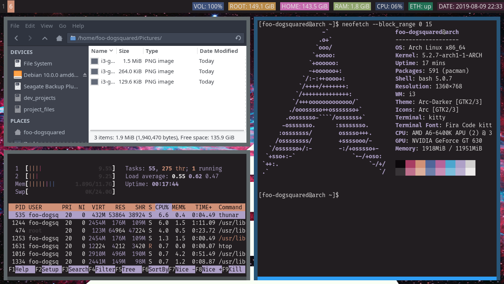
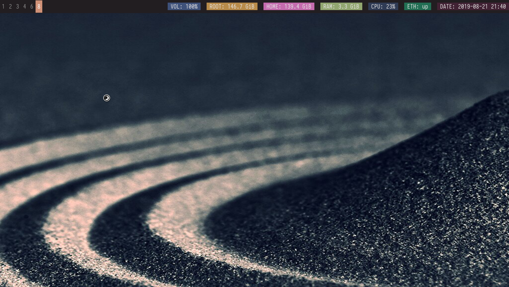

= dotfiles

My dotfiles for my Linux-based system setup.

== Screenshots

== Specifications
Here are the main specifications of my machine currently running this
(as of 2019-08-09):

* **Operating system**: https://www.archlinux.org/[Arch Linux]
* **Display server**: X Window System using https://www.x.org/wiki/[Xorg]
* **Window manager**: https://i3wm.org/[i3] (specifically https://github.com/Airblader/i3[i3-gaps])
* **Terminal emulator**: https://sw.kovidgoyal.net/kitty[Kitty]
* **Shell**: https://www.gnu.org/software/bash/[Bash]
* **Terminal emulator font**: https://github.com/tonsky/FiraCode[Fira Code]

== Configuration details
Here's a list of the programs with details on the config found in this repo:

=== https://www.x.org/wiki/[Xorg]
A display server implementing X window system.

* Config found at link:xorg/[`xorg/`] directory.
* Minimum version (from `Xorg -version`):
** `X.Org X Server 1.20.5`
** `X Protocol Version 11, Revision 0`
* The configuration is found at `.Xresources` containing the colors (0 to 15, 
foreground, and the background)

=== https://www.vim.org/[Vim]
A modal text editor.

* Config located at link:vim/[`vim/`] directory.
* Minimum version (from `vim --version`): 
** `8.1 (2018 May 18, compiled Jul 29 2019 20:38:53)`
* Contains my plugin list and editor configurations at `.vimrc`
* Eventually my https://github.com/sirver/UltiSnips[UltiSnips] snippets
will also be added

=== https://ranger.github.io/[Ranger]
A Vim-based file browser. 
https://github.com/ranger/ranger/wiki[Here's their config documentation for it.]

* Config located at link:ranger/[`ranger/`] directory.
* Minimum version (from `ranger --version`):
** `ranger version: ranger 1.9.2`
** `Python version: 3.7.4 (default, Jul 16 2019, 07:12:58) [GCC 9.1.0]`
* All of the config files are basically default config files except with a 
few changes.
* Contains keybinding in `rc.conf`. Additional keybindings include the `O` 
keybinding and their variants for opening my go-to programs such as 
https://code.visualstudio.com/[Visual Studio Code].
* `rifle.conf` contains configuration for opening a list of programs. 

=== https://sw.kovidgoyal.net/kitty[Kitty] 
A GPU-based terminal emulator. 
https://sw.kovidgoyal.net/kitty/conf.html[Here's the configuration doc for it.]

* Config located at link:kitty/[`kitty/`] directory.
* Minimum version (from `kitty --version`):
** `kitty 0.14.3 created by Kovid Goyal`
* Main config file is `kitty.conf` and it simply sets the font 
(https://github.com/tonsky/FiraCode[Fira Code]) and the color pallete in 
`colors.conf`.
* `colors.conf` contains the same color scheme in `.Xresources`. 
* As a simple reminder: unless you use other than Kitty, the colors 
defined in this `colors.conf` is the one to be used as default color 
pallete in terminal-based programs such as Vim or Ranger, 
not the `.Xresources` file.

=== https://github.com/Airblader/i3[i3-gaps] 
A fork of i3 window manager. 
https://i3wm.org/docs[Here's the documentation page of the program.]

* If it's any of importance, the configuration is prone to be moved for the 
https://github.com/i3/i3/[original version of i3] since 
https://github.com/i3/i3/issues/3724[there's consideration for merging of gaps into i3].
* Config located at link:i3/[`i3/`] directory.
* Minimum version (from `i3 --version`):
** `i3 version 4.17 (04.08.2019) © 2009 Michael Stapelberg and contributors`
* Uses https://github.com/davatorium/rofi[`rofi`] as the application launcher and 
serves as a replacement for https://tools.suckless.org/dmenu/[`dmenu`].
* The containing config (`config`) is simply the default config with my personal 
config added into it. Not much to say here except I use `i3bar` (the default bar) and 
https://github.com/i3/i3status[`i3status`] (the default status bar config) to fill in.
* The config for `i3status` is located in a different directory at link:i3status[`i3status/`]
containing a single `config` file (for now).

=== https://github.com/davatorium/rofi[Rofi]
The application switcher and launcher. Also serves as a replacement 
for https://tools.suckless.org/dmenu/[dmenu].

* Config located at link:rofi/[`rofi/`].
* Minimum version (from `rofi -version`):
** `Version: 1.5.4`
* Main config is `config.rasi`.
* Beside the main config, I've also created my own theme (named `fds-sidebar`) which 
simply makes a sidebar. Every variation of my sidebar theme should import the common 
file (`fds-sidebar-common.rasi`) and only declare the colors. See `fds-sidebar-dark.rasi` for 
an example. 
